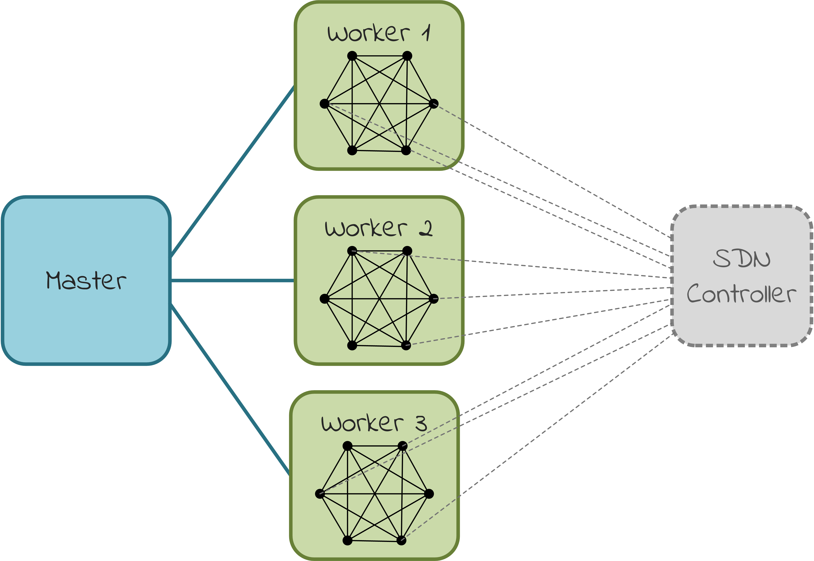

# Multinet

The goal of Multinet is to provide a fast, controlled and resource-efficient way
to boot large-scale SDN topologies. It builds on the [Mininet](https://github.com/mininet/mininet)
project to emulate SDN networks via multiple isolated topologies, each launched on
a separate machine, and all connected to the same controller.

Multinet has been verified with the Lithium release of the OpenDaylight controller,
where we managed to successfully boot a distributed topology of 3000 OVS switches.


_Why isolated topologies?_

The main motivation behind Multinet was to be able to stress an SDN controller
in terms of its switch scalable limits. In this context, Multinet contents
itself to booting topologies that are isolated from each other, without really caring
to be interconnected, as we believe this policy is simple and good enough
to approximate the behavior of large-scale realistic SDN networks and their
interaction with the controller. If creating large-scale _interconnected_
topologies is your primary concern, then you might want to look at other efforts
such as [Maxinet](https://github.com/mininet/mininet/wiki/Cluster-Edition-Prototype)
or the [Cluster Edition Prototype](https://github.com/mininet/mininet/wiki/Cluster-Edition-Prototype)
of Mininet. Instead, Multinet clearly emphasizes on creating scalable pressure to
the controller and provides options to control certain aspects that affect the
switches-controller interaction, such as the way these are being connected during start-up.


_Why multiple VMs?_

The cost to boot a large Mininet topology on a single machine grows
exponentially with the number of switches. To amortize this cost, we opted to
scale out and utilize multiple VMs to spawn multiple smaller topologies in parallel.
Eventually, one of the key questions that we try to answer through Multinet is:
_what is the best time to boot-up a topology of S Mininet switches with the least
amount of resources_?


## Features

- __Large-scale SDN networks__ emulation, using multiple isolated Mininet
  topologies distributed across multiple VMs
- __Controllable boot-up__ of switches in groups of configurable size and
  configurable intermediate delay. This enables studying different policies of
  connecting large-scale topologies to the controller.   
- __Centralized__ and __RESTful__ control of topologies via a master-worker architecture
- __Well-known topology types__ offered out-of-the-box (`disconnected`, `linear`,
  `ring`, `mesh`)
- __Smooth integration with custom topologies__ created via the high-level Mininet API,
  provided they have slightly modified their `build` method





## Getting Started

#### Environment setup

To use Multinet you should have a distributed environment of machines configured
as follows:

- Software dependences:
    - Python 2.7
    - `bottle`, `requests` and `paramiko` Python packages
    - a recent version of Mininet (we support 2.2.1rc)
- Connectivity:
    - the machines should be able to communicate with each other
    - the machines should have SSH connectivity

In the next section we demonstrate how to prepare such an environment using
[Vagrant](https://www.vagrantup.com/) to provision and boot multiple VMs.
If you already have a custom environment set up, jump to
[deployment](#deploy-multinet-on-the-distributed-environment) section.


#### Environment setup using Vagrant

Under the `vagrant` directory we provide scripts and Vagrantfiles to
automatically setup a distributed environment of VMs to run Multinet. The steps
for this are:

1. Provision the base box from which VMs will be instantiated:

   ```bash
   cd vagrant/base/
   ```

   If you sit behind a proxy, edit the `http_proxy` variable in the
   `Vagrantfile`. Then start provisioning:

   ```bash
   vagrant up
   ```

   When the above command finishes, package the base box that has been created:

   ```bash
   vagrant package --output mh-provisioned.box
   vagrant box add mh-provisioned mh-provisioned.box
   vagrant destroy
   ```

   For more info on Vagrant box packaging take a look at
   [this guide](https://scotch.io/tutorials/how-to-create-a-vagrant-base-box-from-an-existing-one)

2. Configure the VMs:

   ```bash
   cd vagrant/packaged_multi/
   ```

   Edit the `Vagrantfile` according to your preferences. For example:

   ```rb
   http_proxy = ''  # if you sit behind a corporate proxy, provide it here
   mh_vm_basebox = 'mh-provisioned' # the name of the Vagrant box we created in step 2
   mh_vm_ram_mini = '2048'  # RAM size per VM
   mh_vm_cpus_mini = '2'  # number of CPUs per VM
   num_mininet_vms = 10   # total number of VMs to boot
   mh_vm_private_network_ip_mini = '10.1.1.70'  # the first IP Address in the mininet VMs IP Address range
   ```

3. Boot the VMs:

   ```bash
   vagrant up
   ```

#### Deploy Multinet on the distributed environment

__TODO__: high-level description of the deployment process, i.e. what it does in brief, from where it should be performed (e.g., from a machine that has access to all master/worker machines?)

1. Configure deployment options editing the `config/deploy_config.json` to your
   preferences:

   ```json
   {
       "multinet_base_dir": "/home/vagrant/multinet",  
       "master_ip" : "10.1.1.70",
       "master_port": 3300,  
       "worker_port": 3333,  
       "worker_ip_list": [ "10.1.1.70", "10.1.1.71" ],  
       "ssh_port": 22,  
       "username": "vagrant",  
       "password": "vagrant"  
   }
   ```

   - `multinet_base_dir` is the location inside the machines where deployment
      files will be copied. This location is common for all participating machines

__TODO__: this explanation is not valid, it needs clarification 

   - `master_ip` is the IP address of the machine where the master will run
   - `master_port` is the port where the master listens for REST requests
      from external client applications
   - `worker_port` is the port where each worker listens for REST requests
      from the master
   - `worker_ip_list` is the list with the IPs of all machines where workers
      will be created to launch topologies
   - `ssh_port` is the port where machines listen for SSH connections
   - `username`, `password` are the credentials used to access via SSH the machines

2. Run the `deploy.py` script in the external user console to copy the 
   necessary files and start the master and the workers:

   ```bash
   [user@my_machine multinet/bin]$ ./deploy --json-config config.json
   ```

#### Initialize Multinet topologies

__TODO__: we need to talk here about the run options. This is were the subsection
of Gradual Boot-up should be transferred? see below

__TODO__: we should mention where (i.e. on which machine) this script should run from


   ```bash
   [user@my_machine multinet/bin]$ ./init_topos --json-config init_config.json
   ```

  This command will build an identical topology in every worker machine.

__TODO__: elaborate more: what is the effect of this handler? how does it work internally at high-level?
what options does it offer to the user? is it sync/asyc? (i.e., when do we know it has finished?)


We observed that the SDN controller displays some instability issues when
it is overwhelmed with switch additions. The solution we pose to this problem
is the gradual switch bootup.  
In more detail, we modified the Mininet `start` method as follows
- We split the switches we need to start in groups
- The size of each group is specified by the `group_size` parameter    
- We start the switches in each group normally  
- After all the switches in a group have started we insert a delay  
- The delay is specified by the `group_delay` parameter  

We have observed that this method allows us to boot larger topologies with
greater stability. Moreover it gives us a way to estimate the boot time of
a topology in a deterministic way.


#### Start Multinet topologies

   ```bash
   python start_topology_handler <master-ip> <master-port> <number-of-vms>
   <starting-ip-in-range>
   ```

   For example:

   ```bash
   python start_topology_handler.py 10.1.1.40 3300 4 10.1.1.40
   ```
   The topologies should now be booted and ready for use

   __TODO__: what is the effect of this handler? how does it work internally at high-level?
   what options does it offer to the user? is it sync/asyc? (i.e., when do we know it has finished?)

__TODO__: we should mention where (i.e. on which machine) this script should run from

#### __TODO__ we need to present here the other handlers as well

#### Stop Multinet

After you have used the topologies you can stop them:

```bash
python stop_topology_handler.py <master-ip> <master-port> <number-of-vms> <starting-ip-in-range>
```

For example:

```bash
python stop_topology_handler.py 10.1.1.40 3300 4 10.1.1.40
```

__TODO__: what is the effect of this handler? how does it work internally at high-level?
what options does it offer to the user? is it sync/asyc? (i.e., when do we know it has finished?)

__TODO__: we should mention where (i.e. on which machine) this script should run from


## System Architecture

The end goal of Multinet is to deploy a set of Mininet topologies over multiple
machines and have them connected to the same controller simultaneously. To make
this possible, every switch must have a unique DPID to avoid naming collisions
in the controller's housekeeping mechanism, and to achieve this, Multinet
automatically assigns a proper DPID offset to each Mininet topology.

The local Mininet topologies are identical in terms of size, structure and 
configuration, and they are all being handled in the same fashion simultaneously. 
For example, during start up, topologies are being
created simultaneously on the worker machines and populated in the same way. To
relieve the end user from having to manage each topology separately, we have
adopted a _master-worker model_ for centralized control.

The __master__ process acts as the Multinet front-end that accepts REST requests
from the end user. At the same time, it orchestrates the pool of workers.
On a user request, the master creates a separate command for each local topology
which it dispatches simultaneously to the workers.
Each __worker__ process controls a local Mininet topology. It accepts commands
from the master via REST, applies them to its topology, and responds back with
a result status. Every worker is unaware of the topologies being operated from
other workers.
The master is responsible to collect partial results and statuses from all workers
and reply to the user as soon as it has a complete global view.

For resource efficiency and speed, it is preferable to create each worker along
with its topology on a separate machine.


## Code Design


#### Code structure

| Path                                             | Description                                     |
|--------------------------------------------------|-------------------------------------------------|
| `figs/`             | Figures needed for documentation |
| `vagrant/`          | Vagrantfiles for fast provisioning of a running environment |
| `config/`           | configuration files for the init handler and the deploy script |
| `handlers/`         | Command line wrappers for the leader commands |
| `util/`             | A more generic utility module |
| `cleanup.sh`        | cleanup script to reset the virtual machines environment |
| `deploy.py`         | Automation script to copy and start the master and the workers in the virtual machines |
| `master.py`         | Master REST server |
| `worker.py`         | Worker REST server |
| `MininetNetwork.py` | Class inheriting from the core `Mininet` with added / modified functionality |
| `topologies.py`     | example topologies |  


#### Interacting with the master programmatically

The master exposes a REST API as described bellow

- Initialize the topologies  
  ```python
  @bottle.route(
    '/init/controller/<ip_address>/port/<port>/switch/<switch_type>/topology/<topo>/size/<size>/group/<group>/delay/<delay>/hosts/<hosts>',
    method='POST')
  ```

- Boot the topologies  
  ```python
  @bottle.route('/start', method='POST')
  ```

- Stop the topologies  
  ```python
  @bottle.route('/stop', method='POST')
  ```

- Perform a `pingall` in each topology  
  ```python
  @bottle.route('/ping_all', method='POST')
  ```

- Get the number of switches in each topology  
  ```python
  @bottle.route('/get_switches', method='POST')
  ```

You can also utilize the following wrapper functions
from the `mininet_handler_util` module

```python
# Send a POST request to the master 'init' endpoint
mininet_handler_util.master_init(master_host,
                                 master_port,
                                 ip_list,
                                 controller_ip_address,
                                 controller_of_port,
                                 switch_type,
                                 mininet_topo_type,
                                 mininet_topo_size,
                                 mininet_group_size,
                                 mininet_group_delay,
                                 mininet_hosts_per_switch)
```

```python
# Send a POST request to any master endpoint (except for 'init').
# The endpoint is specified by the 'opcode' parameter
mininet_handler_util.master_cmd(master_host,
                                master_port,
                                opcode,
                                ip_list)
```

#### Core components

- `MininetNetwork` class  
  - Extends the `Mininet` class.  
  - Adds a dpid offset during the switch creation phase to distinguish between the switches in different instances.  
  - Inserts the notion of gradual switch bootup, inserting some idle time
    (`group_delay`) between the bootup of groups of switches (`group_size`)  
- `worker`  
  - creates its own `MininetNetwork` instance  
  - creates a REST API that wraps the exposed methods of that instance.  
- `master`  
  - exposes a REST API to the end user.  
  - broadcasts the commands to the workers  
  - aggregates the responses and returns a summary response to the end user  


#### Adding your own topologies

First of all **note** that the build method signature of any existing topology
created with the high level Mininet API need to be modified to conform with
the following method signature in order to be compatible
```python
# k is the number of switches
# n is the number of hosts per switch
# dpid is the dpid offset
def build(self, k=2, n=1, dpid=1, **_opts):
```

1. Create a topology with the Mininet high level API, for example

 ```python
 ## mytopo.py
 class MyTopo(Topo):
       "Disconnected topology of k switches, with n hosts per switch."

       def build(self, k=2, n=1, dpid=1, **_opts):
           """
           k: number of switches
           n: number of hosts per switch
           dpid: the dpid offset (to enable distributed topology creation)
           """
           self.k = k
           self.n = n

           for i in xrange(k):
               # Add switch
               switch = self.addSwitch(genSwitchName(i, dpid))
              # Add hosts to switch
               for j in xrange(n):
                   host = self.addHost(genHostName(i, j, dpid, n))
                   self.addLink(host, switch)
 ```

2. Add it to the `MininetNetwork.TOPOS` dictionary

   ```python
   # worker.py
   import mytopo ...
   MininetNetwork.TOPOS['mytopo'] = mytopo.MyTopo
   MININET_TOPO = MininetNetwork( ... )
   ```
   ```python
   # or from inside MininetNetwork.py
   TOPOS = {
      'linear': ...
      'mytopo': mytopo.MyTopo
   }
   ```
